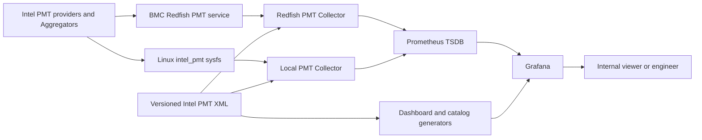
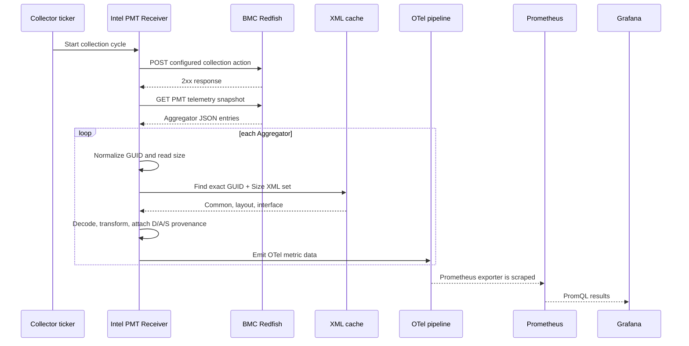
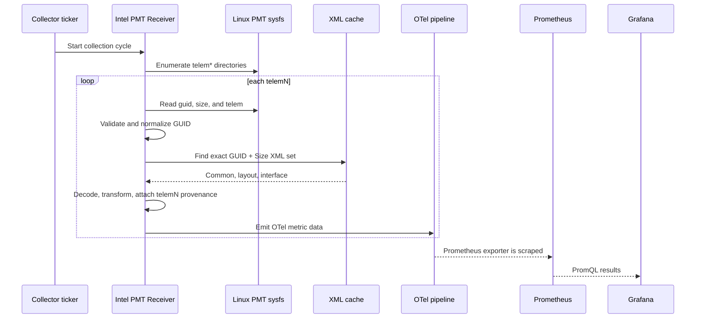
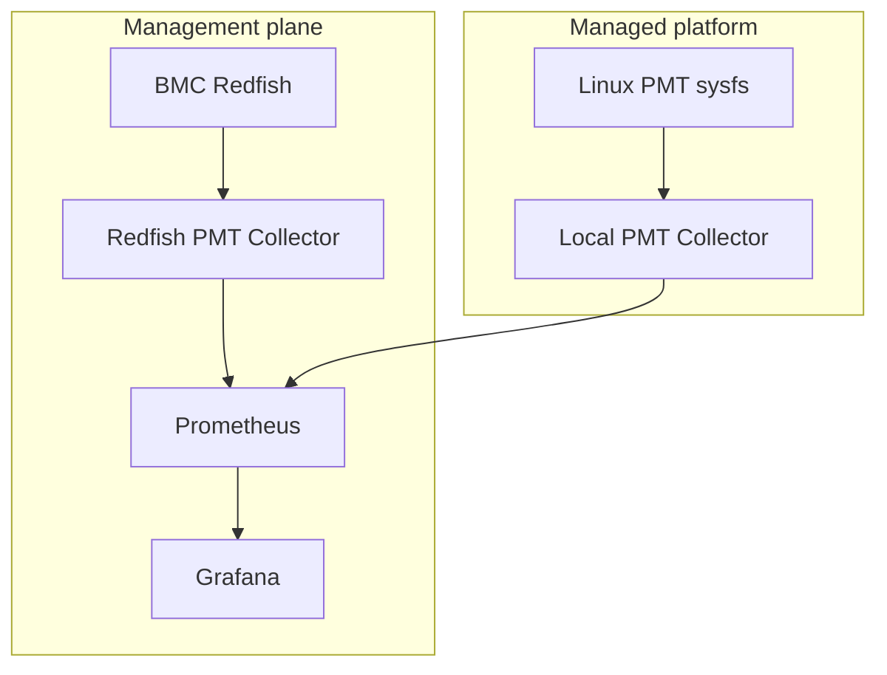

# Intel PMT Telemetry Platform — High-Level Design

> **Intel Internal Only**
>
> Status: Current implementation baseline

## 1. Purpose

This document describes the implemented software architecture that collects
Intel Platform Monitoring Technology (PMT) telemetry through out-of-band and
in-band paths, decodes it into OpenTelemetry metrics, stores it in Prometheus,
and presents it in Grafana.

The design is logical and deployment-neutral. It intentionally omits current
hostnames and IP addresses. Detailed interfaces and algorithms are defined in
`pmt-platform-low-level-design.md`.

## 2. Scope


- BMC Redfish PMT snapshot collection;
- Linux `intel_pmt` sysfs collection;
- PMT Aggregator discovery;
- exact `GUID + Size` schema selection;
- XML-driven binary decoding and transformation;
- OpenTelemetry metric construction;
- Prometheus export, scrape, storage, and query;
- Redfish Overview, Local Overview, and Metric Explorer;
- generated metric catalog and Dashboard artifacts;
- telemetry freshness, provenance, and internal update-quality signals.


## 3. Architectural Drivers

The architecture is shaped by the following requirements:

1. **Two access paths:** the same platform is observable through BMC Redfish and
  Linux PMT sysfs, but the path-local instance locators differ.
2. **Schema-driven decoding:** binary payload meaning depends on exact platform
  metadata and cannot be inferred from byte position alone.
3. **Layout reuse:** several physical or logical Aggregator instances may share
  one GUID and size because GUID identifies a layout, not a serial number.
4. **Large metric surface:** the current catalog contains 5,285 exact names and
  many more labeled time series.
5. **Semantic safety:** units, reset behavior, and codebooks are incomplete for
  some families; the UI must preserve raw semantics instead of guessing.
6. **Reproducibility:** Collector configuration, XML metadata, metric guidance,
  and Dashboard JSON must be versioned and regenerable.
7. **Operational isolation:** one malformed or unsupported Aggregator should
  not discard valid data from the rest of the collection cycle.


## 4. System Context




The BMC and Linux expose two observations of platform telemetry. They are not
treated as 72 distinct physical telemetry blocks merely because each path
discovers 36 instances. Conversely, the system does not claim that a particular
Redfish locator and `telemN` are the same physical instance until a physical
discovery mapping exists.

## 5. Logical Component Architecture


### 5.1 Intel PMT provider and Aggregator

An Aggregator is a hardware/firmware-backed logical telemetry data space. It is
not a CPU Core, Socket, or independent chip. A provider exposes one or more
Aggregator instances containing:

- fixed binary sample containers;
- data and internal timestamps;
- GUID and payload size;
- status or incomplete-update fields;
- telemetry for one functional domain, such as Core, RMID, PCU, FIVR, QAT, or
topology.


### 5.2 BMC Redfish PMT service

The Redfish service is the OOB source adapter. It provides:

- a collection action that requests a PMT snapshot;
- a snapshot endpoint returning a JSON envelope;
- one entry per Aggregator with GUID, size, attributes, collection timestamp,
and Base64 payload.

Authentication and TLS policy are deployment configuration. Credentials are
not part of the application model.

### 5.3 Linux PMT sysfs

The Linux `intel_pmt` driver is the in-band source adapter. It provides
`telemN` directories under a configured sysfs root. Each usable device exposes:

- `guid`;
- `size`;
- `telem` binary data.

The Local Collector assigns the read time as the collection timestamp and
retains hostname and sysfs path as path-local provenance.

### 5.4 Intel PMT Receiver

The custom OpenTelemetry receiver is the central decode component. Its
responsibilities are:

1. validate mode and interval configuration;
2. load the root metadata map;
3. discover Redfish or Local Aggregators;
4. match exact GUID and size to an XML set;
5. load and cache XML common types, layout, and interface definitions;
6. decode binary containers;
7. evaluate referenced transformations;
8. construct metric values and provenance attributes;
9. emit OpenTelemetry gauges or cumulative monotonic sums;
10. repeat immediately at startup and then on the configured interval.

The same processing path is used after transport-specific discovery, which
limits semantic drift between Redfish and Local collection.

### 5.5 OpenTelemetry Collector pipeline

Each PMT Collector process contains:

- `intelpmtreceiver`;
- a batch processor;
- a Prometheus exporter;
- optional debug or auxiliary OTLP components in deployment configuration.

The current PMT scrape interval is 20 seconds. The receiver itself enforces a
minimum interval of five seconds.

### 5.6 Prometheus

Prometheus is the current telemetry database. It:

- scrapes the Collector Prometheus exporters;
- stores samples and labels as time series;
- evaluates instant and range PromQL;
- supplies metadata used by catalog generation;
- serves as the Grafana datasource.

Prometheus does not store the XML schema, Dashboard source, metric-guide source,
or physical-topology documentation. Those remain version-controlled files.

### 5.7 Grafana

Grafana provides three current user interfaces:

- fixed-path OOB / Redfish Overview;
- fixed-path In-band / Local Overview;
- Metric Explorer.

The two Overview dashboards use the same information hierarchy and curated
metric domains but different Core-instance selectors. Metric Explorer exposes
the complete metric-name surface without crowding the Overview.

### 5.8 Artifact generators

Two Python generation paths support the presentation layer:

- the GNR Dashboard generator produces Redfish Overview, Local Overview, and
Metric Explorer JSON;
- the catalog generator reads exposed metrics and metadata, applies family
guidance, and writes the exact-name CSV, summary, and family reference.

Generated files are build artifacts with stable UIDs and regression tests. They
must not be edited manually.

## 6. End-to-End Data Flows


### 6.1 Redfish OOB flow




Error handling is per endpoint and per Aggregator. A failed action, HTTP
request, or JSON decode prevents that endpoint's cycle from producing data. A
missing XML set or bad individual Aggregator skips only that Aggregator.

### 6.2 Local in-band flow




Unreadable or malformed `telemN` entries are ignored while enumeration
continues.

### 6.3 Presentation flow

```text
Prometheus series
  → fixed CollectionMode query
  → path-specific variables
  → semantic PromQL transformation
  → bounded readable panel
```

Counter queries use a transformation justified by their family semantics, such
as a five-minute increase. Gauges are normally read directly. A multi-name range
query copies `__name__` into a normal label before functions that remove metric
name, preventing duplicate label sets.

## 7. Schema and Decode Architecture


### 7.1 Metadata hierarchy

The root PMT metadata maps supported platform layouts to an XML set. An XML set
contains:

1. common datatype definitions;
2. Aggregator binary layout;
3. Aggregator interface, sample descriptions, and transformations.


### 7.2 Matching rule

```text
discovered GUID + discovered payload size
  → exact lookup
  → XML base directory and files
```

GUID alone is not accepted as proof of compatibility. Size protects against
firmware or schema variants that reuse a layout identifier with incompatible
payload extent.

### 7.3 Transform execution

The receiver resolves each sample's input references from decoded raw values,
then evaluates the transformation formula from XML. For example, a
`U64.38.26` Core usage value is converted by the XML-defined division by
`2^26` before it reaches Prometheus.

The presentation layer must not repeat a Collector transformation. PromQL
operates on already transformed exported values.

### 7.4 Metadata caching

Common datatypes, Aggregator layout, and Aggregator interface are cached by XML
base directory for the lifetime of the receiver. This avoids reparsing the same
layout for every instance and cycle.

## 8. Information Model


### 8.1 Metric

An exported metric has:

- lowercase name;
- HELP/description;
- declared unit, possibly empty;
- gauge or cumulative monotonic sum type;
- one numeric datapoint per processed Aggregator sample;
- collection timestamp;
- provenance labels.


### 8.2 Time series

A time series is the combination of metric name and complete label set. One
metric name can produce many series because it exists on multiple Aggregators,
paths, or platform instances.

### 8.3 Aggregator layout identity

`PMTGuid + PMTSizeBytes` identifies the decode layout. It does not uniquely
identify a physical Aggregator instance.

### 8.4 Access-path instance identity

Redfish currently uses:

```text
PMTEndpoint + CollectionMode=redfish + DeviceId + AccessId + SourceId
```

Local currently uses:

```text
PMTEndpoint + CollectionMode=local + AccessId=telemN
```

The labels are intentionally retained in their native path semantics. A future
canonical physical ID is outside the current implementation.

### 8.5 Core identity

`Core N` is an XML field within a selected Core Aggregator layout. It is not a
global platform Core number, APIC ID, or Linux logical CPU.

### 8.6 RDT identity

RDT series use CHA and RMID encoded in metric names and extracted into display
labels. RMID identifies a resource-monitoring context, not a process. Application
ownership requires external allocation context.

## 9. Dashboard Architecture


### 9.1 Information architecture

Both Overviews contain:

- 3 navigation cards;
- 7 telemetry rows;
- 25 curated metric panels;
- 33 PromQL targets.

Rows progress from availability and key signals to Core, RDT/memory, FIVR/power
policy, QAT, data trust, and technical inventory.

### 9.2 Redfish selectors

The Redfish Dashboard selects one path-local Core context using:

```text
endpoint → DeviceId → AccessId → SourceId → XML Core field
```


### 9.3 Local selectors

The Local Dashboard selects one path-local Core context using:

```text
endpoint → telemN → XML Core field
```


### 9.4 Metric Explorer

Metric Explorer is a technical surface for exact metric-name search, current
values, raw labels, history, and appropriate rate/delta comparison. It is not a
customer summary and does not convert unknown semantics.

### 9.5 Unit policy

Panel units are assigned only from evidence:

- XML or metric suffix for established units;
- mathematically valid rate or increase for established cumulative counters;
- no physical unit for unresolved raw values.

The Dashboard generator contains regression tests preventing raw panels from
claiming unsupported physical units.

## 10. Logical Deployment




The diagram is logical. Components may be co-located or separated by deployment
policy. Required communication classes are:

- HTTPS from Redfish Collector to BMC;
- filesystem access from Local Collector to PMT sysfs;
- Prometheus scrape access to Collector exporters;
- Grafana server-side access to Prometheus;
- browser access to Grafana or an approved read-only reverse proxy.


## 11. Security Architecture


### 11.1 Credentials

BMC authorization is injected at runtime. Credential values are excluded from
version-controlled YAML and generated artifacts.

### 11.2 Transport

Redfish uses HTTPS. Any deployment that disables certificate verification is a
deployment exception and must be reviewed; it is not a product security
guarantee.

### 11.3 User access

Grafana access is read-only for viewers. Prometheus is consumed through the
Grafana server-side datasource and need not be exposed to viewer browsers.

### 11.4 Data sensitivity

PMT values, topology, firmware identity, and internal platform names are
internal engineering data. The current dashboards are marked Internal.

## 12. Reliability and Failure Isolation


| Failure                      | Architectural response           | User-visible effect                                          |
| ---------------------------- | -------------------------------- | ------------------------------------------------------------ |
| Missing root metadata        | Receiver startup fails           | No new metrics from that Collector                           |
| Source endpoint unavailable  | Endpoint cycle logs an error     | Freshness ages; other Collector path may remain available    |
| One `telemN` unreadable      | Entry is skipped                 | Partial Local inventory                                      |
| Unknown GUID/size            | Aggregator is logged and skipped | Missing domain or instance                                   |
| Missing transform input      | Sample is skipped with warning   | Partial fields within an Aggregator                          |
| Transform evaluation failure | Sample is skipped with warning   | Partial fields within an Aggregator                          |
| Unsupported numeric value    | Metric is skipped                | Isolated missing metric                                      |
| Downstream consumer failure  | Collector logs consumption error | Prometheus data becomes stale                                |
| Prometheus scrape failure    | Target becomes down              | Grafana freshness and data disappear                         |
| Invalid PromQL               | Panel error                      | Static and live query validation shall detect before release |


The current architecture does not queue PMT samples for later replay. A failed
cycle produces a gap; it does not backfill source history.

## 13. Performance and Scale


### 13.1 Current scale characteristics

The current platform exposes:

- 36 Aggregator instances per collection path;
- 7 observed GUID/size layout families;
- 5,285 exact metric names;
- 32,710 observed series per path and 65,420 across both paths;
- a high-cardinality series set created by instance and provenance labels.

These are observed current-platform facts, not fixed protocol limits.

### 13.2 Controls

- XML files are cached.
- Collection interval is configurable with a five-second lower bound.
- Overview panels use curated names and bounded top results.
- Metric Explorer handles full-name discovery.
- Prometheus retention and resources must be sized for interval, series count,
and required history.


## 14. Operability

The platform is diagnosed bottom-up:

```text
source availability
  → Aggregator discovery
  → GUID/size schema match
  → decode and transform logs
  → Collector exporter
  → Prometheus target and query
  → Grafana datasource and panel
```

Dashboard availability alone is not proof of current source data. Data Freshness
and internal update heartbeat are separate signals.

## 15. Architectural Decisions


| Decision                                     | Rationale                                                  | Consequence                                |
| -------------------------------------------- | ---------------------------------------------------------- | ------------------------------------------ |
| Use Prometheus as current telemetry database | Native time-series labels and PromQL match metric workload | XML and UI metadata remain versioned files |
| Keep OOB and Local Overviews separate        | Their instance locators and selectors are different        | Cross-path viewing requires navigation     |
| Match XML by GUID and size                   | Prevent incompatible layout decoding                       | Unknown pairs are skipped                  |
| Decode in the receiver                       | One semantic transformation point for both paths           | Dashboard must not repeat XML scales       |
| Preserve path-native labels                  | Avoid invented physical mappings                           | A future canonical identity remains open   |
| Generate dashboards and catalogs             | Reproducibility and reviewable semantics                   | Manual generated-file edits are prohibited |
| Keep full metric surface in Explorer         | Overview remains readable                                  | Engineering detail requires a separate UI  |


## 16. System-Level Verification


| Area          | Verification                                                                        |
| ------------- | ----------------------------------------------------------------------------------- |
| Source access | Redfish action/GET and Local sysfs reads succeed independently                      |
| Discovery     | Expected current Aggregator inventory is found on both paths                        |
| Schema        | Every required GUID/size resolves to one XML set                                    |
| Decode        | Representative gauge, counter, transformed fixed-point, and packed fields match XML |
| Export        | Collector exporter exposes PMT HELP, TYPE, value, and provenance                    |
| Storage       | Prometheus target is healthy and both CollectionMode values are queryable           |
| UI            | Both Overview UIDs and Explorer UID load through Grafana                            |
| Selectors     | Redfish and Local variables resolve only their own path                             |
| Query         | All fixed-path Overview PromQL targets parse and execute                            |
| Semantics     | Counter, gauge, raw-unit, Idle, unavailable, and sentinel behaviors match guidance  |
| Quality       | Freshness, heartbeat, and incomplete-cycle movement can be distinguished            |
| Reproduction  | Generator, catalog, and regression test commands complete from source               |


